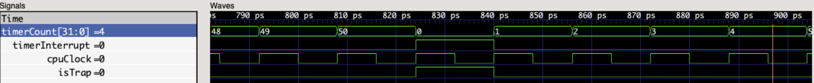

# 32-bit RISC-V Preemptive Multitasking Core

A cycle-accurate implementation of a 32-bit RISC-V processor built from scratch in SystemVerilog. This project demonstrates **Hardware-Enforced Preemptive Multitasking** on a bare-metal Single-Cycle architecture.

**Current Status:** Phase 3 Complete (Hardware Interrupts & Context Switching Verified)

---

## Architectural Philosophy & Trade-offs
This core was designed with specific constraints to prioritize architectural clarity and atomic instruction execution.

### 1. The "Preemptive-Lite" Scheduler
* **Mechanism:** Uses a custom hardware timer that triggers a trap (`timerInterrupt`) every 2,000 clock cycles.
* **Policy:** Implements a **Round-Robin** scheduler written in C (`scheduler.c`).
* **Why Round-Robin?** While simple, it provides deterministic task switching and ensures fairness (anti-starvation), which is critical for verifying the hardware interrupt logic.

### 2. The "Zero-Wait" Combinational Bus
* **Design:** A custom memory interface modeled on the **AXI-Lite Topology** (separate Read/Write Address & Data channels).
* **The Solution:** To maintain a strict **CPI = 1 (Single-Cycle)** performance without complex stall logic, the `READY` signal is tied HIGH. This creates an atomic, high-performance combinational path.


### 3. Atomic Interrupt Handling
* **Mechanism:** Because every instruction completes in exactly one cycle, interrupts are **Atomic**. The processor finishes the current instruction and traps to the OS vector (`0x10`) on the same clock edge, ensuring architectural consistency.

---

## System Modules

### 1. SoC Top (System-on-Chip)
The integration layer connecting the CPU to the "Outside World".
* **Memory Architecture:** Physically split Instruction (ROM) and Data (RAM) blocks to prevent **Structural Hazards**.
* **Preemption Timer:** A hardware "heartbeat" that enforces the time slice. It asserts `timerInterrupt` when `timerCount >= TIMER_LIMIT`.

### 2. The Controller (The Brain)
Updated to support the **Trap & Return** lifecycle.
* **Trap Vectoring:** PC Multiplexer forcibly jumps to `0x00000010` while saving the current address to `mepc`.
* **Return Logic:** Decodes `mret` to restore `PC <= mepc`, resuming the user program seamlessly.

### 3. Modular Firmware Stack
* **`crt0.s`**: Low-level assembly entry and Trap Vector table at `0x10`.
* **`scheduler.c`**: C-based kernel logic managing the `task_stack_pointers`.
* **`main.c`**: Application layer defining Task A and Task B.


---

## Verification (Phase 3)

The waveform demonstrates the "Reflex" action of the CPU:
1. **Trigger**: `timerInterrupt` goes HIGH.
2. **Response**: PC jumps to `0x10` (Trap Handler).
3. **Restoration**: `mret` restores the PC to the saved address.




---

## How to Run

### Prerequisites
* **Simulator**: `brew install verilator gtkwave`
* **Toolchain**: `riscv64-unknown-elf-gcc`

### Setup (One-time)
1. **Configure Toolchain**: Update `RISCV_BIN_PATH` in `config.sh` to your local `bin` directory.
2. **Set Permissions**: Run `chmod +x run.sh config.sh` once.

### Execute Simulation
Run the master simulation script:
```bash
./run.sh soc_top