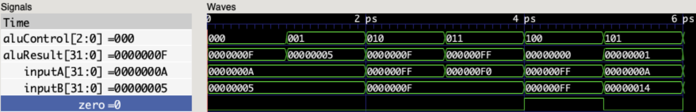
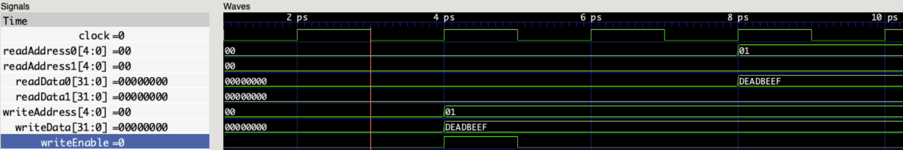

# 32-bit RISC-V Core (SystemVerilog)

A cycle-accurate implementation of a 32-bit RISC-V processor built from scratch in SystemVerilog. This project focuses on understanding the microarchitecture of the RV32I instruction set, verified using C++ testbenches via Verilator.

**Current Status:** Epoch 1 Complete (ALU & Register File Verified)

---

## 🏗 Architecture Modules

### 1. Arithmetic Logic Unit (ALU)
A pure combinational logic block handling all integer arithmetic and logical operations.
* **Inputs:** `inputA`, `inputB` (32-bit)
* **Control:** `aluControl` (3-bit selector)
* **Features:** Zero-flag generation (`zero`) for branch logic.
* **Supported Ops:** ADD, SUB, AND, OR, XOR, SLT.

**Verification:**
The ALU was verified against a C++ testbench checking corner cases and standard arithmetic.


*Figure 1: GTKWave trace demonstrating ALU operation switching between ADD (0x0) and SUB (0x1).*

### 2. Register File
A standard 32x32-bit Register File.
* **Read Ports:** `readAddress0`, `readAddress1` (Asynchronous)
* **Write Port:** `writeAddress`, `writeData` (Synchronous on Clock)
* **Constraint:** Register 0 is hardwired to 0. Reads from `5'b00000` always return `32'b0`.

**Verification:**
Verified read-after-write consistency and `x0` immutability.


*Figure 2: Waveform showing simultaneous reads and a synchronous write operation (Writing 0xDEADBEEF to reg x1).*

---

## 🚀 How to Run

This project uses **Verilator** for fast C++ based simulation and **GTKWave** for debugging.

### Prerequisites
* **MacOS:** `brew install verilator gtkwave`
* **Linux:** `sudo apt install verilator gtkwave`

### Simulation Script
A unified build script `run.sh` handles compilation and execution.

```bash
# 1. Make the script executable
chmod +x run.sh

# 2. Run the ALU Testbench
./run.sh alu

# 3. Run the Register File Testbench
./run.sh regfile
