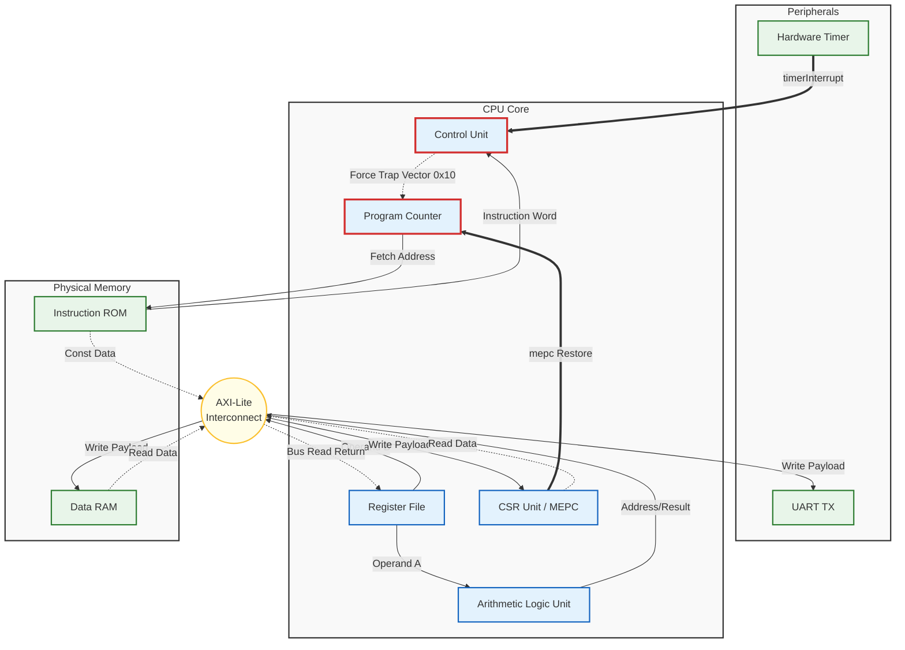

# RISC-V Preemptive Multitasking SoC


> **A synthesized, cycle-accurate 32-bit RISC-V processor implementing hardware-enforced preemptive multitasking and a custom bare-metal kernel.**

---

## System Demonstration: Preemptive Task Switching
The following simulation output demonstrates the core's ability to handle **hardware-triggered context switches**. The system timer forces a trap every 2,000 clock cycles, causing the kernel to preempt the current thread (`Task A`) and schedule the next ready thread (`Task B`) deterministically.


*(Figure 1: Real-time kernel scheduler operation within the Verilator simulation environment)*

---

## System Architecture

The SoC features a custom **Harvard Architecture** utilizing a decoupled AXI-Lite interconnect. The design emphasizes **Hardware/Software Co-Design**, exposing low-level system events directly to the firmware via a strict Memory-Mapped I/O (MMIO) interface.



---

## Hardware-Software Interface

The system achieves atomic preemption through a tightly coupled interaction between the SystemVerilog Control Unit and the assembly-level trap handler.

### 1. Trap Vector Execution (`0x10`)
Upon detecting the `timerInterrupt` signal, the Control Unit asserts a trap state, forcing the Program Counter to the vector base address `0x10`. The firmware immediately preserves the architectural state:

```asm
# firmware/crt0.s
trap_vector:
    addi sp, sp, -128      # 1. Allocate Exception Stack Frame
    sw ra, 0(sp)           # 2. Preserve Return Address
    sw t0, 4(sp)           # 3. Preserve Temporary Registers
    ...
    mv a0, sp              # 4. Pass Stack Pointer to Scheduler
    call scheduler         # 5. Invoke Scheduling Algorithm (C)
    mv sp, a0              # 6. Retrieve New Task Stack Pointer
    ...
    mret                   # 7. Execute Atomic Hardware Return
```

### 2. Physical Memory Layout (`link.ld`)
A custom linker script enforces a precise memory map, ensuring that the compiler places sections in alignment with the hardware address decoder.

| Memory Region | Address Range | Function |
| :--- | :--- | :--- |
| **.text** | `0x00000000` - `0x00001000` | Instruction Memory (ROM) |
| **.data** | `0x20000000` - `0x20001000` | System Stack & Heap (RAM) |
| **MMIO** | `0x40000000` - `0x40000010` | Peripheral Control & Status |

---

## Verification Methodology

The core was validated using a multi-layered verification strategy, progressing from block-level unit tests to full system integration testing.

### Interrupt Latency Analysis
To validate the atomicity of the preemption mechanism, simulation traces were analyzed to measure the cycle-accurate response of the Control Unit.


> **Trace Analysis:**
> 1.  **Event Trigger:** `timerCount` reaches the comparator threshold.
> 2.  **Context Capture:** The `pc` signal transitions to `0x10` on the subsequent rising edge.
> 3.  **Pipeline Integrity:** The trace confirms zero instruction loss during the trap transition.

---

## Build & Simulation Instructions

The project utilizes `Make` for build automation and `Verilator` for high-speed cycle-accurate simulation.

```bash
# 1. Clone the repository
git clone [https://github.com/snapat/AFTCC-RISCV.git](https://github.com/snapat/AFTCC-RISCV.git)

# 2. Compile Firmware & Simulate SoC
./run.sh soc_top

# 3. Analyze Waveforms
open simulation_trace.vcd
```

---

## Repository Structure

<details>
<summary><strong>Expand File Hierarchy</strong></summary>

```text
├── rtl/                # SystemVerilog RTL Sources
│   ├── soc_top.sv      # SoC Top-Level Integration
│   ├── controller.sv   # Control Unit & Trap Logic
│   └── bus_inter.sv    # AXI-Lite Bus Interconnect
├── firmware/           # Bare-Metal Firmware
│   ├── crt0.s          # Vector Table & Startup Code
│   ├── scheduler.c     # Task Scheduling Algorithm
│   └── link.ld         # Linker Script & Memory Map
├── sim/                # Verification Environment
│   ├── soc_top_tb.cpp  # C++ System Testbench
│   └── ...
└── images/             # Documentation Assets
```
</details>

---

*Engineered by **Napat (PJ) Sungkamee**.*